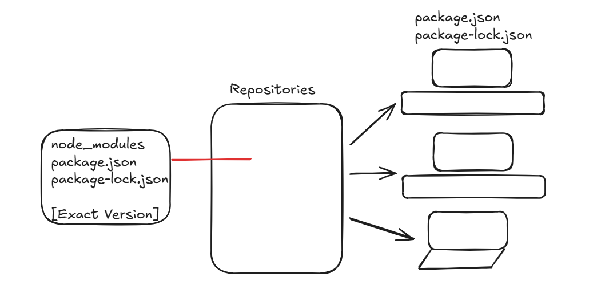

<h1 align="center">⚡️💻 React 📜✨</h1>

React is not a framework it is a library give by facebook to perform DOM operation. So, that the user will be very happy in seeing the change in the UI

### What is CDN?
- It is a mechanism to request the resource from the external computer so that latency rate would be low.

### What is CORS?
- It is a mechanism where two applications are running in two different server where scripts would share the data between them.
- If the script asks for a resource the other script would send the response.
- If the script asks

if the script asks for a resources the order script 


### Creating an Element 

#### Signature

const element = React.createElement(
    type,  // HTML tag name or React component
    props, // Object with props/attributes or null
    ...children // Child element or text
)

### Accessing the DOM

#### signature

cosnt container = document.getElementById("idName")
cosnt root = ReactDOM.createRoot(container)

### usage of { } in React.createElement

# React Code in Production Environment

As a developer, when we write code, our code should be **Bundled | Compressed | Minified** so that it can be pushed to the Production Environment.  
Let us now see how the code can be scaled up and pushed to Production Environment.


### What is NPM?
**Ans:** It manages `node_modules` related packages.


### Adding NPM to Our Project
```bash
cmd> npm init
```

Once this command is triggered, npm will automatically add a **`package.json`** file.
For npm, the `package.json` file is a **configuration file**.

**package.json:**
It will keep all the dependencies along with their versions, and npm will manage them.


## Preparing Code for Production

After writing code using a library or framework, it should be pushed to the production environment.
To do this, we need a **bundler** like **Vite**, **Parcel**, or **Webpack**.

If our project contains `.html`, `.css`, and `.js` files, we need to bundle them before sending them into the production environment.

**Examples of Bundlers:**

* webpack
* parcel
* vite


## Using Parcel to Bundle Our App

We will use **Parcel** to bundle our app.

```bash
cmd> npm install -D parcel
```


**Note:**
* To work with javascript evenronment we use a build tool called npm
* To work with java evenronment we use a build tool called Maven and Gradle (latest in market)

**Note:** 
* When ever we install dependencies to our project there would be 2 types
    * dev dependencies	: it means we need these dependencies during development phase.	
    * normal dependencies  : we need these dependencies in production phase + development phase.



npm : node package manger
node_modules [libraty files got saved]

npx : node package executables
no installation, directly run by taking the help of registration [temporary perpsose]

>cmd npx parcel index.html

## Role of Parcel

* It uses minification mechanism to render the production code.
* It uses a file watching algorithm to generate a faster response on UI.

We can use **Parcel** for build purposes (production-ready code).

### How to tell the user that our application supports only on specific versions of browsers?

```json
"browserslist": [
  "defaults"
]
```

---

### Binding Commands in `package.json`

Instead of running the command `npx start index.html`, we can bind this command in `package.json` and use `npm` commands to start our project.

```json
"scripts": {
  "start": "parcel index.html",
  "build": "parcel build index.html",
  "test": "jest"
}
```

### React DOM Logic


Older versions of React used API calls more frequently to write DOM logic.
To resolve this, recent versions of React use **JSX** to render DOM logic.

**JSX** stands for *JavaScript XML* (syntax similar to HTML).

* While writing JSX attributes must be written in camel case.

## Let us now learn React Component

ReactComponent = A React-based UI building block. <br>
In a webpage React component represents: header, footer,....

### We have 2 types of Component

1. Class based Component : old style
2. Function based Component : new style

**Note:** React component defines logic + UI <br>
render() returns JSX layout

### Function Based Component
1. It is created using functions of javascript
2. Name of the function should be in **'uppercase'.**
3. It should return some **JSC ReactElement**


**Syntax:**
```js
const HeadingComponet = function (){
  return(
    //jsx code ==========> ReactElement
  );
}

ReactDOM.createRoot(document.getElementById("root")).render(<HeadingComponet />)
```

> <a href="../src/jsx-code/App.js">JSX</a>

> <a href="../src/Function-jsx/App.js">Function-JSX </a>

> <a href="../src/Componet-notFunction/App.js">Component No Function </a>


**Note:**
We can use {} to bind any jscode in out React using JSX

eg#1.
```js
const Title = () =>(
  <span>React</span>
);
```

```jsx
const Heading = ()=>return(
  <div id='container'>
    {Title()}
    <Title></Title>
    <Title/>
    <h1> Learn {Title()} from PWIOI </h1>
  </div>
);
```

**Note:** JSX is making our code readable.


## Passing Arguments to Functional Components in React

**Q. What if we need to pass the arguments to functional components?**
**Ans.** Props are normal JavaScript function arguments.

Passing props to the components means they are **properties**.

### Example:

```jsx
<RestaurantCardComponent resName="Meghana Foods" cuisine="Biryani, North Indian, Asian" />

<RestaurantCardComponent resName="KFC" cuisine="Burger, Fast Food" />
```

### Functional Component with Props

```jsx
// Using props object
const CardContainer = (props) => {
  return (
    <div>
      <h2>{props.resName}</h2>
      <p>{props.cuisine}</p>
    </div>
  );
};

// Using destructuring
const CardContainer = ({ resName, cuisine }) => {
  return (
    <div>
      <h2>{resName}</h2>
      <p>{cuisine}</p>
    </div>
  );
};
```

### Note

It is a convention to keep the parameter name as **`props`** since it holds the properties sent from the component.

### Note 

While iterating over an array, we need to identify every element uniquely. To do this, we must assign a **`key`** to each element.

* The **`key`** value should be a unique identifier.
* ⚠️ Do not use the array index as the key, since it may cause performance issues.

### Example

```jsx
const items = ["Apple", "Banana", "Orange"];

function ItemList() {
  return (
    <ul>
      {items.map((item) => (
        <li key={item}>{item}</li>
      ))}
    </ul>
  );
}
```

## Different ways of Presenting the UI


## Routing 
Routing referece to navigating to from one page to another page while navigating, we want only a particular portion not the entair doucument
* if we go for html hyper links navigation will happen but browser will rerender the entire document which rerender the en
npm i react-router-dom

react-router[API's to use]
1) createBrowerRouter
2) RouterProvider
3) Outlet

- To create a route, we need to create a routing configuration in App.js [root level component]

### createBrowerRouter
* createBrowerRouter([...routes]) -> takes an array of route objects.

Each route object can have:
a) path -> the URL path (e.g., /about)
b) element - > The React component to render
c) children -> nested routes (works like <Outlet />) 
d) errorElement -> Compoent to show on errors (like 404)

createBrowserRouter
[{},{}]

path : '',
element : ComponentName

render(<RouterProvider router = [{path:'},{}]
\>)
use r

## Rendering Child components under one page

SPA : Single Page Application

## Dynamic Routing

key Points about usage of hooks in the components

**Note:**
1) Never create useState() variable outside the Component, it creates an Error.
const BodyComponent = ()=>{
    const [restaurants,setRestautants] = useState([])
}
2) Always create a stateVariable at the beggining of the component
3) Never create useState() inside if else because it would create inconsistency